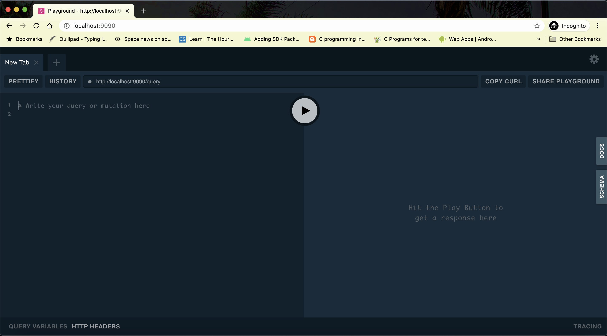
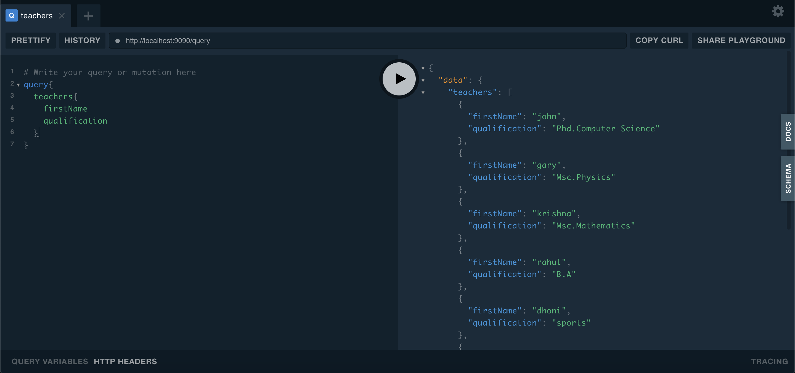

go-graphql
---

  GraphQL server example using Golang and MongoDb as backend.
  
  details:
  - used package by 99designs that generates boilerplate code.
  - define type definitions and package will create function signatures and implementation.
  - more details about graphql https://graphql.org/

  # Run Aplication
   - Bring up the database
      
      ```
        make db #pulls the mongodb latest image and run the container
        make db-up #excutes the script.js
      ```
   - Run Service
      ```
        cd server
        go run server.go
      ```
   - How to test or execute query?
      - server should be up and running on port 9090
        
      - playground lists the types of queries available with the service followed by schema/json that returns.
        
      - here is the query examples
        
        
        
